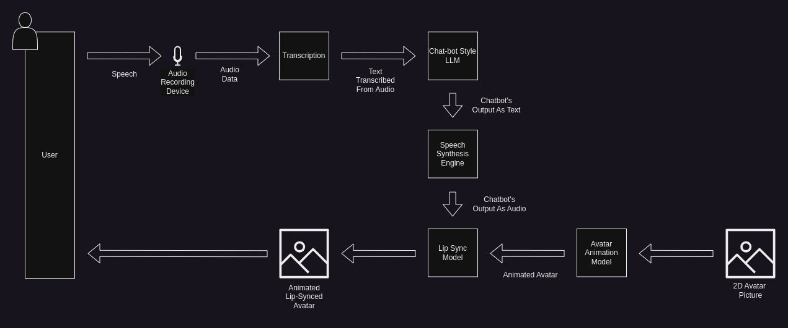

# High Level Design

## 1. Introduction

### 1.1. Document objective

This document, known as the High-Level Design (HLD), serves as a general guide to the overall architecture and design of a system. It provides an overview of the system's components, their interactions, and the technologies used. The HLD includes details about system architecture, data design, interface design, and security considerations. It is intended to provide a clear, broad view of the system's design, serving as a roadmap for developers and stakeholders throughout the development process.

### 1.2. Project objective

The objective of this project is to deliver a foundational MVP solution providing an advanced, interactive chatbot, designed to engage in conversation through a voice-activated interface that handles both input and output. The chatbot is embodied in a dynamic, animated avatar, which is lip-synced to mirror the bot's vocal responses, creating an immersive and engaging user experience.

### 1.3. Scope

The High Level Design document covers a broad and general description of the solution, its component parts and their interactions. It will cover system architecture, providing a high-level diagram, description of data flows, general description of individual components and their role in the whole solution, and list any dependencies - wether hardware, software or on external systems

### 1.4. Target Audience

This document is a starting point for everyone who needs to understand the most important components of the solution and how those individual parts interact with each other. Considering the nature of the project this document will be of use mostly to **developers** and **architects**, as a reference point during work on more detailed low-level design and implementation. 

## 2. Background

## 2.1. Problem Statement

Currently, popular AI-powered chatbots are confined to solely text-based communication. However, various open-source AI models allow today for easily performing text transcription, voice synthesis and image animation. Put together those technologies allow for enhancing chatbot interaction by delivering two-way voice interaction and animated avatar. This project aims to provide a single solution that integrate those technologies providing easy-to-use and user friendly interactive chatbot with audio-visual interface.

## 2.2. Functional Requirements

1. Voice-to-Text Transcription:
    
    * Convert user speech into accurate text.
    * Recognize and handle various accents and dialects for broader accessibility.

2. Conversational Engine:
    
    * Allow integration with various available chatbot engines (weather open-source or not).
    * Send transcribed texts to the integrated system and obtain the responses.

3. Text-to-Voice Synthesis:

    * Convert chatbot's text responses into audible speech.
    * Produce human-like vocal outputs that are clear and natural.
    * Offer different voice profiles to cater to diverse user preferences.

4. Avatar Animation:

    * Display an avatar that visually represents the system.
    * Synchronize the avatar's lip movements seamlessly with the system's audio output.
    * Provide a range of avatar designs to cater to different user tastes.

5. Operational Modes:

    * Local Mode: Allow the system to run on a user's local machine with features that may have limited real-time responses.
    * Cloud Mode: Enable deployment on cloud resources for optimal performance, with an expectation of reliable internet connectivity.

## 2.3. Technical Requirements

## 3. System Architecture

### 3.1. High-level Architecture Diagram

### 3.2. General Components Description

This application's architecture is designed with a singular focus on individual user experiences. While the potential for a multi-user application exists, the current design does not incorporate scalability considerations. The system comprises distinct frontend and backend applications, both hosted on the same server.

The frontend application, implemented as a web application, facilitates direct communication with the backend server. It handles user input, transmits it to the backend, and presents the server-generated results to the user. Additionally, the frontend serves as a configuration hub, enabling users to personalize the system. This includes uploading a chosen image for avatar animation and adjusting settings related to various stages of the process. Configuration options are divided into basic and advanced categories, catering to different levels of user expertise and ensuring the system's accessibility and flexibility.

The backend application processes audio recordings of user input from the frontend. These recordings are transcribed into text by a transcription model, which then fuels the Large Language Model (LLM). The LLM generates a text output that is transformed into an audio recording by a text-to-speech model. This audio recording animates the avatar's lip sync, and the final product, a video file featuring the animated avatar and audio response, along with the original LLM's text response, is returned directly to the frontend.

The backend initiates the potentially time-consuming process and promptly sends a confirmation to the frontend. The frontend can then periodically check the process's status, displaying progress status to keep the user informed. Once the pipeline is finished, the results are directly returned to the frontend.

In the event of execution failure, error handling provides clear communication to the user. All error logs are stored on the server for future debugging, and the frontend offers an option to inspect these logs directly.

While the current system architecture executes all stages sequentially on a single server, future iterations of this project may explore more complex computational strategies. Despite the system's reliance on multiple AI models, it maintains simplicity in its architecture, eliminating the need for distributed processing or parallelization. However, future projects based on the achievements of this one, may incorporate these advanced computing capabilities to further enhance performance and efficiency.

## 4. System Features

### 4.1. Description

The system is underpinned by a suite of specialized Artificial Intelligence models, each dedicated to a unique aspect of its comprehensive functionality. This includes a voice-to-text transcription model that accurately converts user speech into text, a conversational engine powered by a state-of-the-art Large Language Model that generates intelligent and contextually relevant responses, a text-to-voice synthesis model that vocalizes the chatbot's responses in a natural and human-like manner, and an avatar animation model that automatically syncs the avatar's lip movements with the system's audio output.

Designed with a broad user base in mind, this system aims to cater to various user profiles, from individuals seeking engaging digital interaction to those looking for a unique, AI-powered conversational companion. The system's scope extends to a wide range of applications, including but not limited to personal digital assistance, interactive entertainment, and educational uses.

Designed with flexibility in mind, this system can be run locally on a user's machine, albeit with potential limitations on real-time response and smoothness of experience, or can be deployed on cloud-based resources for optimal performance. 

Key assumptions made during the design process include a steady and reliable internet connection for users opting for the cloud-based operation, and a high level of digital literacy among the target user base. Potential risks, such as data privacy breaches and system downtime, have been identified and addressed through robust security measures and a reliable system architecture.

In essence, this solution represents a significant leap forward in interactive technology, offering users a unique, engaging, and human-like way to interact with digital platforms, beyond the confines of traditional text-based communication. The project is a testament to the power of combining various freely available, cutting-edge technologies in artificial intelligence. The exercise of integrating these diverse AI models into a cohesive, functional system is a goal in itself, demonstrating the potential of AI when harnessed in innovative and synergistic ways.

### 4.2. Use Cases

## 5. Non-Functional Requirements

### 5.1. Scalability

### 5.2. Performance

### 5.3. Reliability

### 5.4. Security

### 5.5. Compliance

## 6. Interfaces

### 6.1. User Interfaces

### 6.2. API Specifications

### 6.3. Third-party Integrations

## 7. Testing Strategies

### 7.1. Types of Tests

### 7.2. Test Data Requirements

## 8. Deployment Plan

### 8.1. Deployment Architecture

### 8.2. Release Strategy

## 9. Risks and Mitigations

### 9.1. Risks Assessment

### 9.2. Mitigation Plans

## 10. Timeline

### 10.1. Milestones

### 10.2. Project Phases

## 11. Appendices 

### 11.1. Additional Diagrams

### 11.2. Glossary

### 11.3. References

## 12. Revision History
